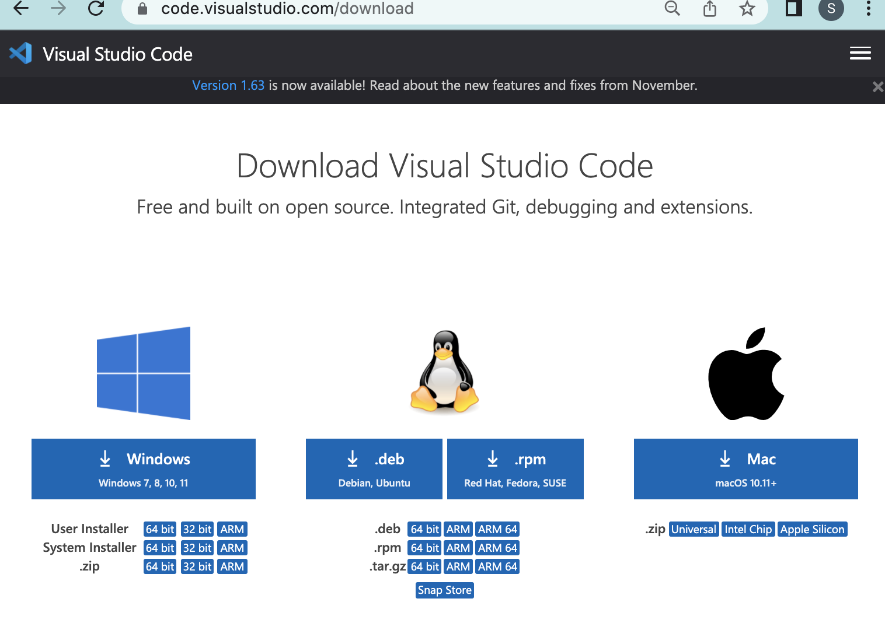
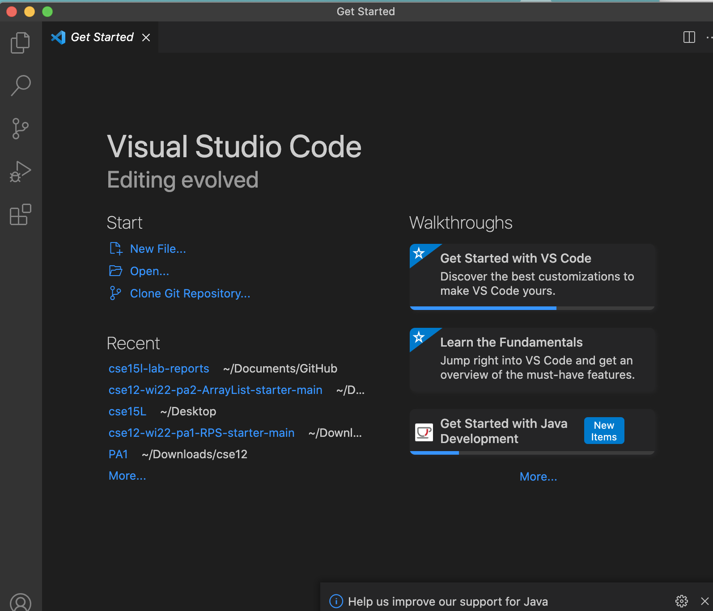
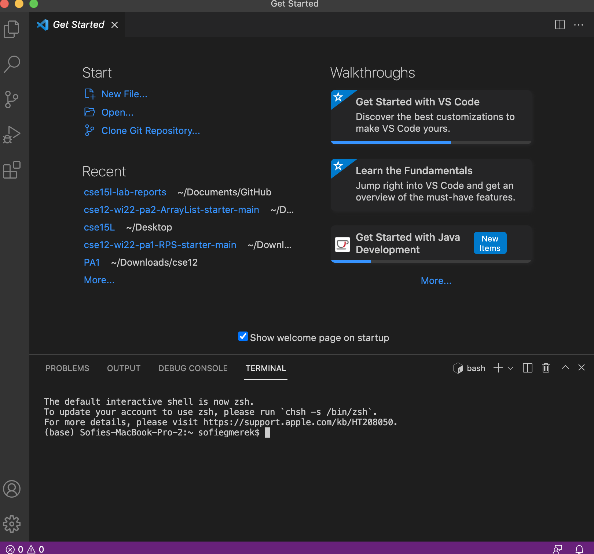
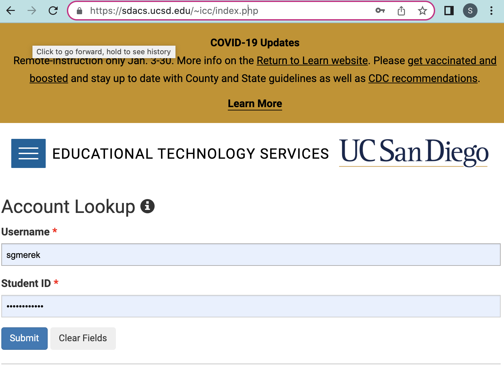
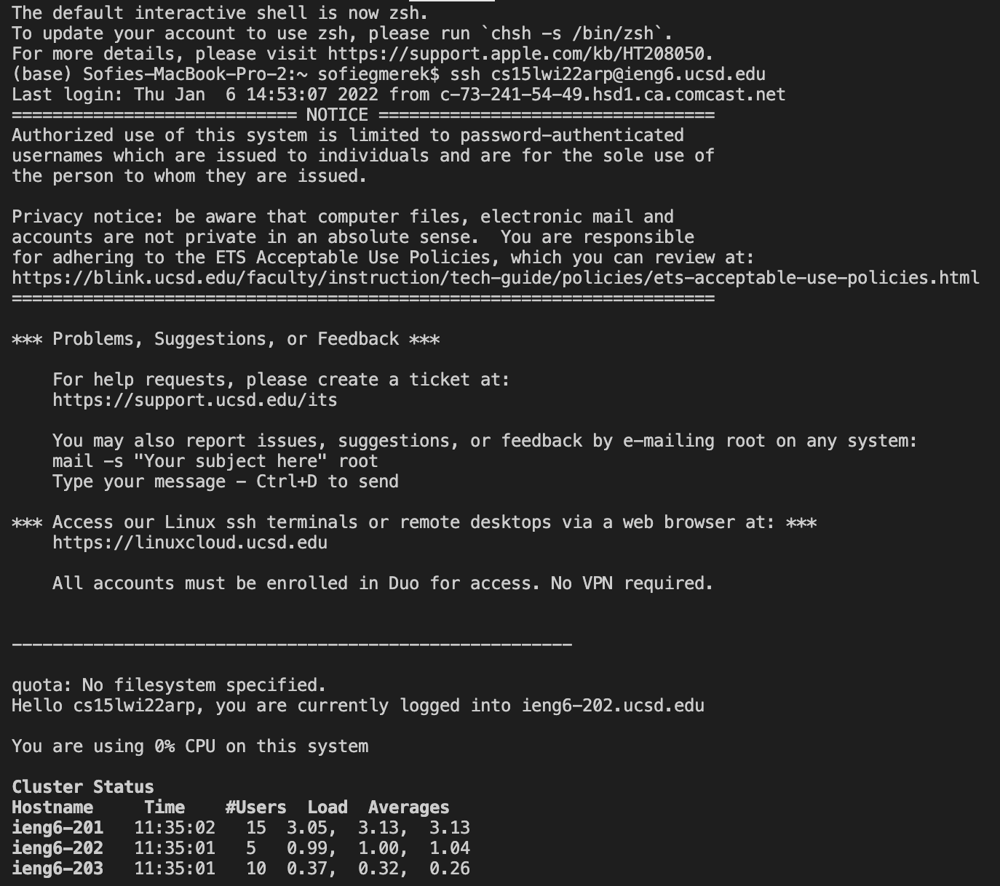

# Lab 1 Report: Starting in CSE 15L

1. Installing VS Code
2. Remotely Connecting
3. Trying Some Commands
4. Moving Files with scp
5. Setting an SSH key
6. [Optimizing Remote Running](#optum)

## Installing VS Code
 To install VS Code go to the [VS Code Download](https://code.visualstudio.com/download) page. Click on the correct download for your system and follow the instructions to download it.

Then open VS Code and it should have a screen with various options such as making a new file, opening files, and recent files.

To open a terminal go to the top of your screen and click the "Terminal" option, then click "New Terminal" and you should see a terminal to use at the bottom of the window.

To open a new file, click on "New File" or go to the top toolbar and click "File" then select the "New File" option. You can select a text file or java class.
  
## Remotely Connecting 
Now we are going to connect to the UCSD account remotely for the class. This account can be found at the [Account Lookup Tool](https://sdacs.ucsd.edu/~icc/index.php). Put in your username (first part of email) and your student ID starting with A or U and click submit. 

Now you should see additional accounts starting with cs15lwi22xxx. Where the x's are letters unique to you. Click on the account and then change your password. You must change the password for the account. When changing your password be sure to uncheck the change to the tritonlink password and to make sure you have the correct username. The change can take some time to go into effect.
Once you have your account password changed now we can begin connecting to the account. Open a terminal in VS code and type in the comman "ssh cs15lwi22xxx@ieng6.ucsd.edu" but replace the x's with your account. It will then ask for your password. 
**Note: the password will not show anything on the terminal, but it is still beiing typed in.**
Once you've logged in it should show your last login and information about the system.

## Trying Some Commands 

## Optimizing Remote Running