# Lab 1 Report: Starting in CSE 15L

1. [Installing VS Code](#Lab1_1)
2. [Remotely Connecting](#Lab1_2)
3. [Trying Some Commands](#Lab1_3)
4. [Moving Files with scp](#Lab1_4)
5. [Setting an SSH key](#Lab1_5)
6. [Optimizing Remote Running](#Lab1_6)


## Installing VS Code<a name = "Lab1_1"></a>
 To install VS Code go to the [VS Code Download](https://code.visualstudio.com/download) page. Click on the correct download for your system and follow the instructions to download it.
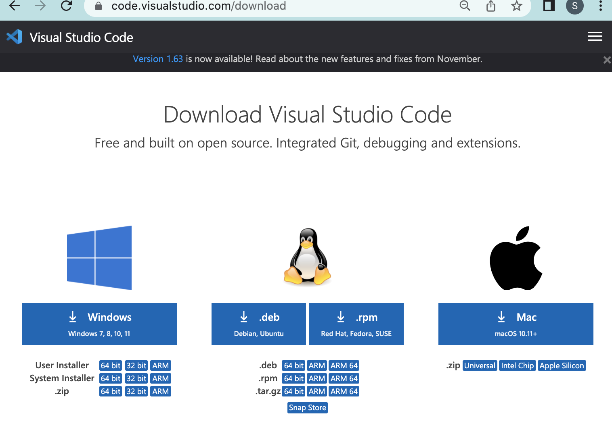
Then open VS Code and it should have a screen with various options such as making a new file, opening files, and recent files.

To open a terminal go to the top of your screen and click the "Terminal" option, then click "New Terminal" and you should see a terminal to use at the bottom of the window.
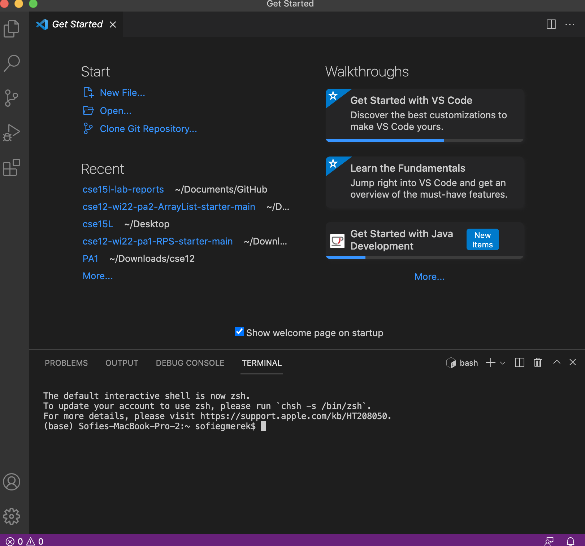
To open a new file, click on "New File" or go to the top toolbar and click "File" then select the "New File" option. You can select a text file or java class.
  
## Remotely Connecting <a name = "Lab1_2"></a>
Now we are going to connect to the UCSD account remotely for the class. This account can be found at the [Account Lookup Tool](https://sdacs.ucsd.edu/~icc/index.php). Put in your username (first part of email) and your student ID starting with A or U and click submit. 
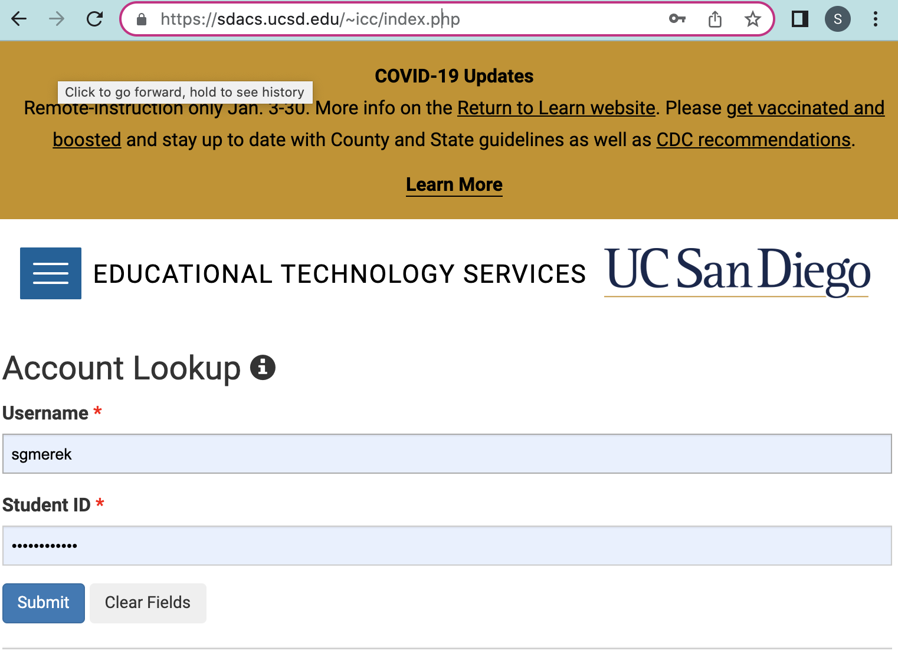
Now you should see additional accounts starting with cs15lwi22xxx. Where the x's are letters unique to you. Click on the account and then change your password.
 <br/> You **must** change the password for the account. When changing your password be sure to uncheck the change to the tritonlink password and to make sure you have the correct username.  <br/>The change can take some time to go into effect.
Once you have your account password changed now we can begin connecting to the account. Open a terminal in VS code and type in the command "
```
ssh cs15lwi22xxx@ieng6.ucsd.edu
``` 
but replace the x's with your account. It will then ask for your password.  <br/>
**Note: the password will not show anything on the terminal, but it is still beiing typed in.**  <br/>
Once you've logged in it should show your last login and information about the system.
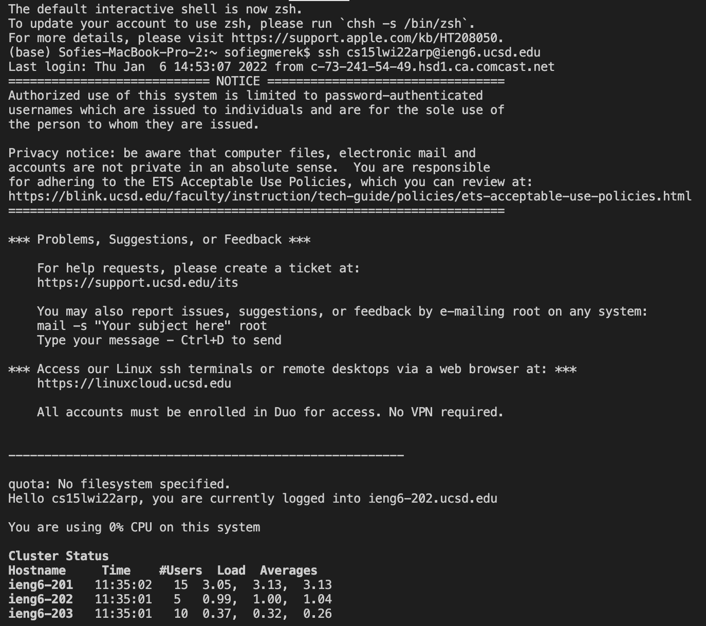 
To exit type logout or exit in the command line.


## Trying Some Commands <a name = "Lab1_3"></a>
There are many commands you can run in the terminal to learn and see more about the system. 
Some are 
- ls 
- cd
- pwd 
Here is a resource for other commands. [Linux Commands](https://ss64.com/bash/)
When you type ls you should see a list of files in the current directory. 
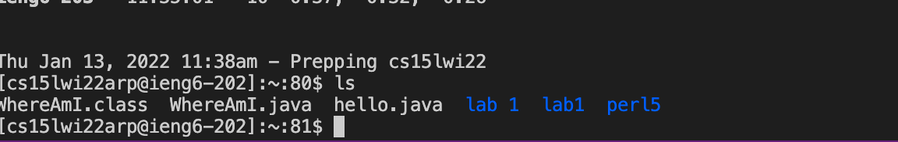
There are also add ons to commands such as ls -a which will show all files, including hidden.
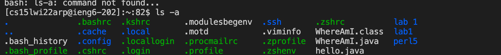
Try out some other commands and see what you get.

## Moving Files with scp<a name = "Lab1_4"></a>
Now we are going to move files from our local computer to the remote computer with the "scp" command. <br/> To do this we need to make a file on our computer, let's call it Hello.java.
 <br/>In Hello.java we are going to print out "Hello" using this code.
```
public class Hello {
    public static void main(String[] args) {
    System.out.println("Hello");
    }
}
```
Now we are going to move the file to the remote server with scp. Using the command 
```
 scp Hello.java cs15lwi22xxx@ieng6.ucsd.edu:~/
 ```
It will ask for a password and then move the file over. Then login using ssh and use ls to check if the file is there.
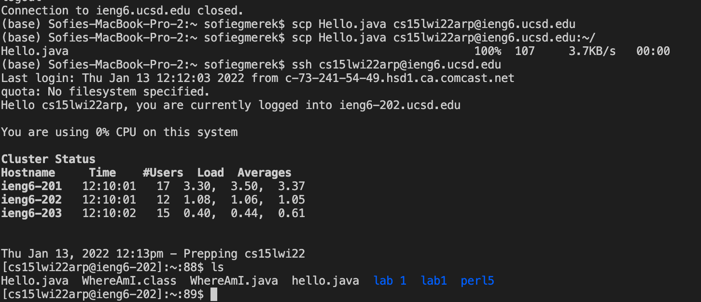
You can also run the java file on the remote server using javac Hello.java and java Hello and it should print Hello.

## Setting an SSH Key<a name = "Lab1_5"></a>
It can take time and cause frustration when you have to keep typing the password in. This can be made faster and easier by using an ssh key. <br/>You have a public and private key with the local computer and the server and the ssh command will use those keys to connect instead of the password. 
<br/>So you need to run "ssh-keygen" which will generate a key pair. And ask where you would like to save it. <br/>Put it in a file called
```
/Users/your_name/.ssh/id_rsa
```
 Then it will give you an image.
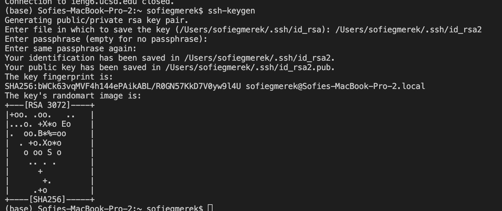
Now you need to copy the public key onto the school server account. First enter your school account on the terminal like we did before. Then we are going to make a folder with "mkdir .ssh" to store the key. Then log out of the school account and on your computer scp the key over with 
```
scp /Users/your_name/.ssh/id_rsa.pub cs15lwi22xxx@ieng6.ucsd.edu:~/.ssh/
authorized_keys"
```
```
        scp /Users/your_name/.ssh/id_rsa.pub cs15lwi22xxx@ieng6.ucsd.edu:~/.ssh/authorized_keys"
```

Now you should be able to ssh and scp without typing in your password!


## Optimizing Remote Running<a name = "Lab1_6"></a>
There are further ways we can make our running faster and more optimized. One way is by running multiple commands in one line. This can be done with putting a semicolon between the commands on the same line. For example we can compile and run java code in one line. 
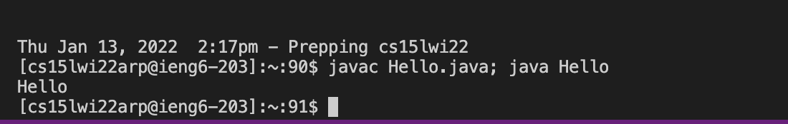
Another way to optimize is to run commands without logging into the server, by putting ssh and the location, with the command in double quotes. 
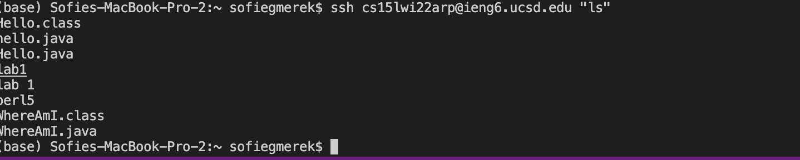
You can combine these and run multiple commands on the remote server without logging in.
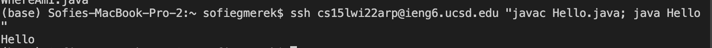