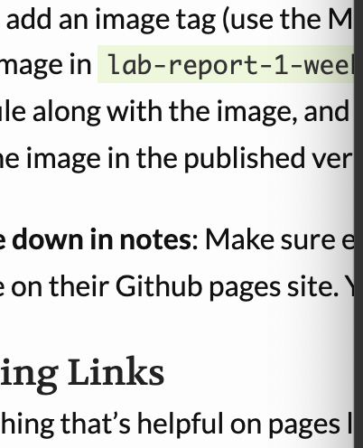

# Lab 1 Report: Starting in CSE 15L

1. Installing VS Code
2. Remotely Connecting
3. Trying Some COmmands
4. Moving Files with scp
5. Setting an SSH key
6. [Optimizing Remote Running](#optum)

## Optimizing Remote Running