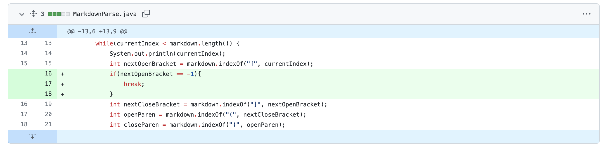
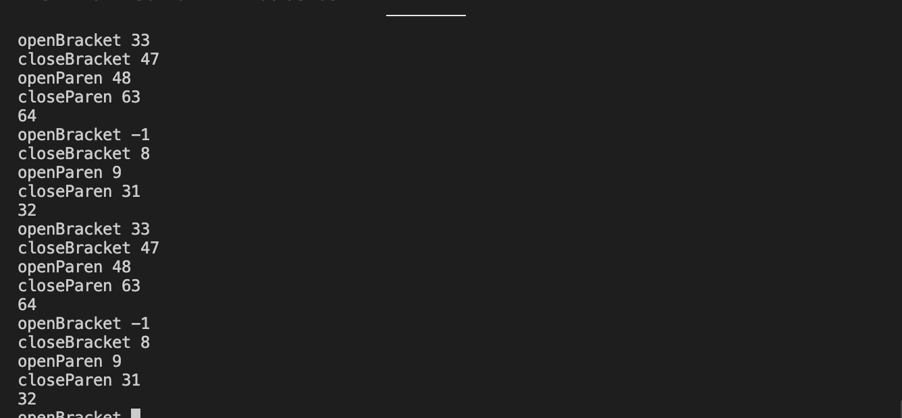
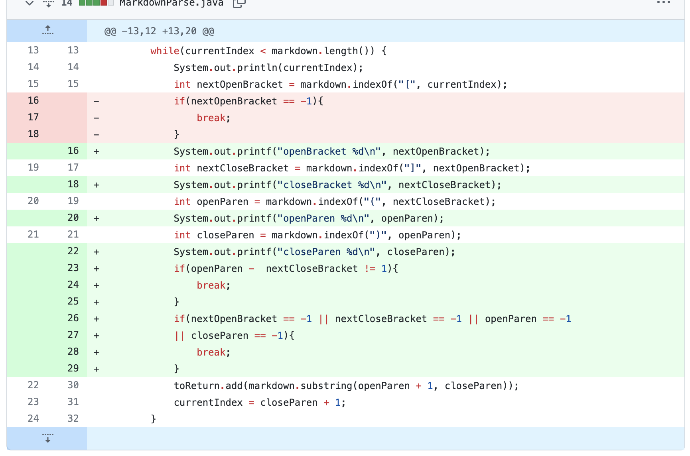
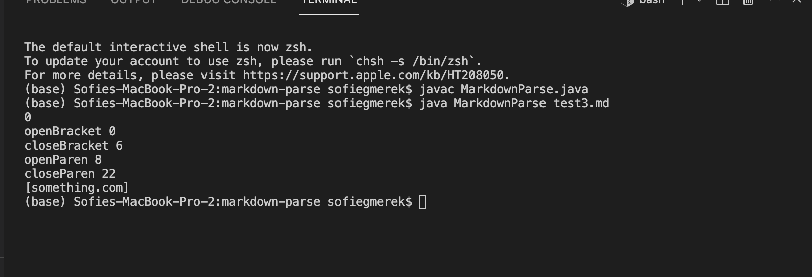
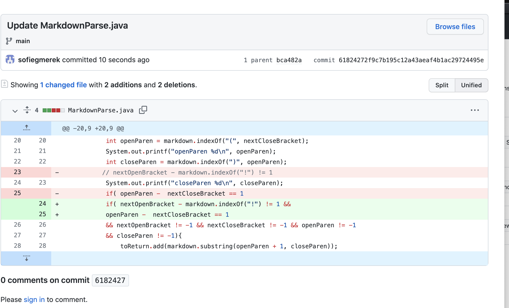
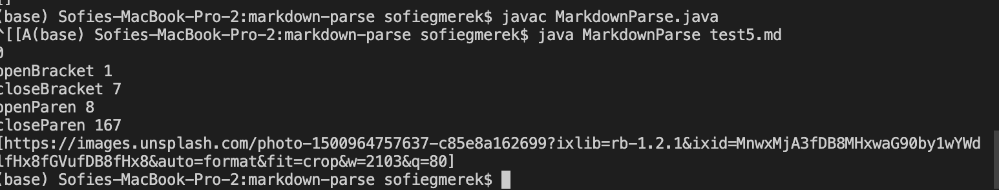

# Lab 2 Report: Bugs 

1. [Bug 1: Mantis](#Lab2_1)
2. [Bug 2: Ladybug](#Lab2_2) 
3. [Bug 3: Bumblebee ](#Lab2_3)

## Bug 1: Mantis <a name = "Lab2_1"></a>
This bug involved having an extra line or two lines at the end of the file. For this case the bug was in the code, as it tried to keep looking and the currentIndex would not increase because they couldn't find another bracket or parentheses. 
The symptoms was an infinite loop as it kept looking for the next link and never finding it, but still having more to the file.

[Test 4 file, two extra lines at the end](https://github.com/sofiegmerek/markdown-parse/blob/main/test4.md)
This is the output


## Bug 2: Ladybug <a name = "Lab2_2"></a>
This bug involved putting a space between the links contents, which does not provide a valid markdown link, but was deemed correct by the program. The bug was that it was just checking if the symbols existed but not if there was no space between the bracket and the parentheses. The symptom was it was outputting the link as valid, even though it was not. To fix this we added a check if the difference between the closing bracket and opening parentheses is not 1 then break.
We added 
```     
 if(openParen - nextCloseBracket != 1){ 
     break; }
```

[File where link was separated](https://github.com/sofiegmerek/markdown-parse/blob/deb99fb928baf47a95876b498d5a68b29435a1a8/test3.md )
Here is the output



## Bug 3: Bumblebee <a name = "Lab2_3"></a>
Our next bug dealt with the similarities between the image format in html and the link format. An image is formatted as 
"\!\[Image]\(link )" which could be misinterpreted as a link. In out program this was a bug, the program was not checking if it was an image. The symptom was that an image was treated as a link and put into the arraylist. To fix this we added a check to see if there was an ! directly before the first bracket. We also combined the if statements to make it cleaner and so that it wouldn't immediately break, as there could be a valid link after an invalid one.

[Test file causing issues](https://github.com/sofiegmerek/markdown-parse/blob/main/test5.md)

