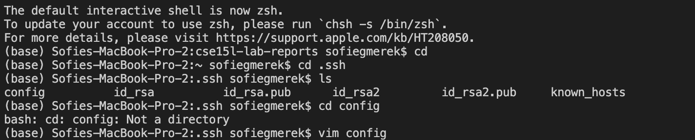
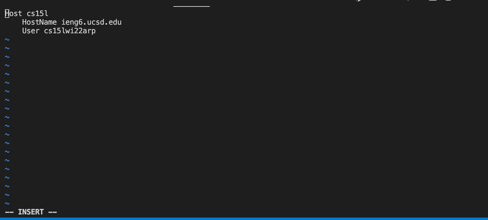
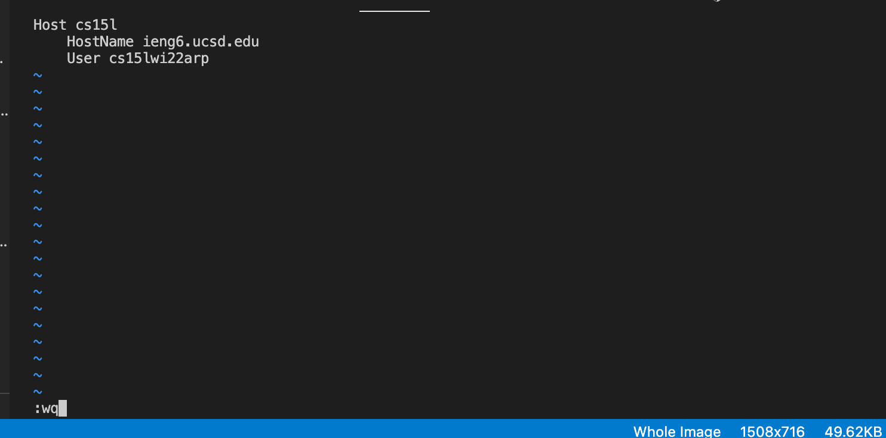
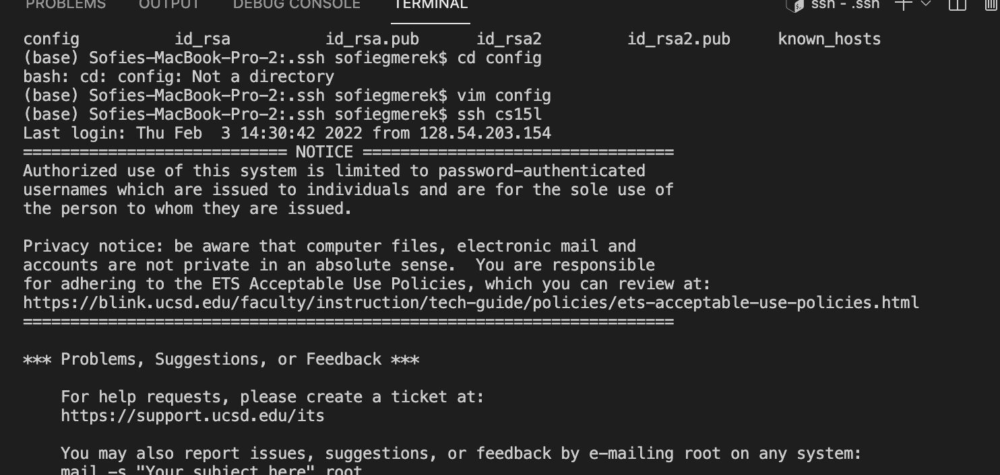
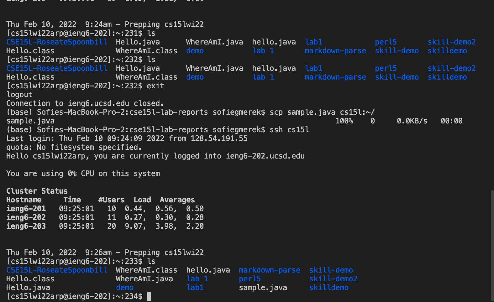

# Lab 3 Report: Streamlining ssh Configuration

Using the ssh to connect to our remote account can be useful but also time consuming. We've already seen how to make it faster by using an ssh key so we do not have to put in our password every time we connect. However our account names cs15lwi22xxx@ieng6.ucsd.edu can take awhile to type, annd spelling errors can cause issues. To fix this we are going to streamline it further with an alias, or another name we can use to ssh.


##Step 1: The ssh config file
To  begin this process we need to go into our local computer into the .ssh folder. You can do this with cd into the folder. In this folder you will either edit or create a config file. I used vim in my terminal.
```
cd  //get to home user
cd .ssh
vim config
 ```


When you go to edit the file in vim you first need to press "I" on your keyboard to begin editing. It will say insert at the bottom like this and you can start typing.

Then you can add in the lines to make your alias.
```
Host  cs15l (alias name)
    HostName ieng6.ucsd.edu
    User cs15lwi22zzz (your username)
```
To save these changes in vim, first press the "esc" key, then press ":wq" which means write and quit. It should show this at the bottom like in this picture.

Now your config file is all set up!
Try to ssh into it with your alias. 
``` 
ssh cs15l (or your alias)
```
And it should ssh like this:

If not you can add a line to specify your key file in the config. 
```
Host  cs15l (alias name)
    HostName ieng6.ucsd.edu
    User cs15lwi22zzz (your username)
    IdentityFile ~/.ssh/id_rsa_ucsd
```
Not only can you ssh with this alias but you can alos do other commands with it such as scp, or copy files over to the remote server. 
To do this I made a new file on my local machine called sample.java, then I ran the command
```
scp sample.java cs15l
```
And it was successful!
Here is a picture of what it should look like:

As you can see before the remote account did not have sample.java, but after scp it did have it!