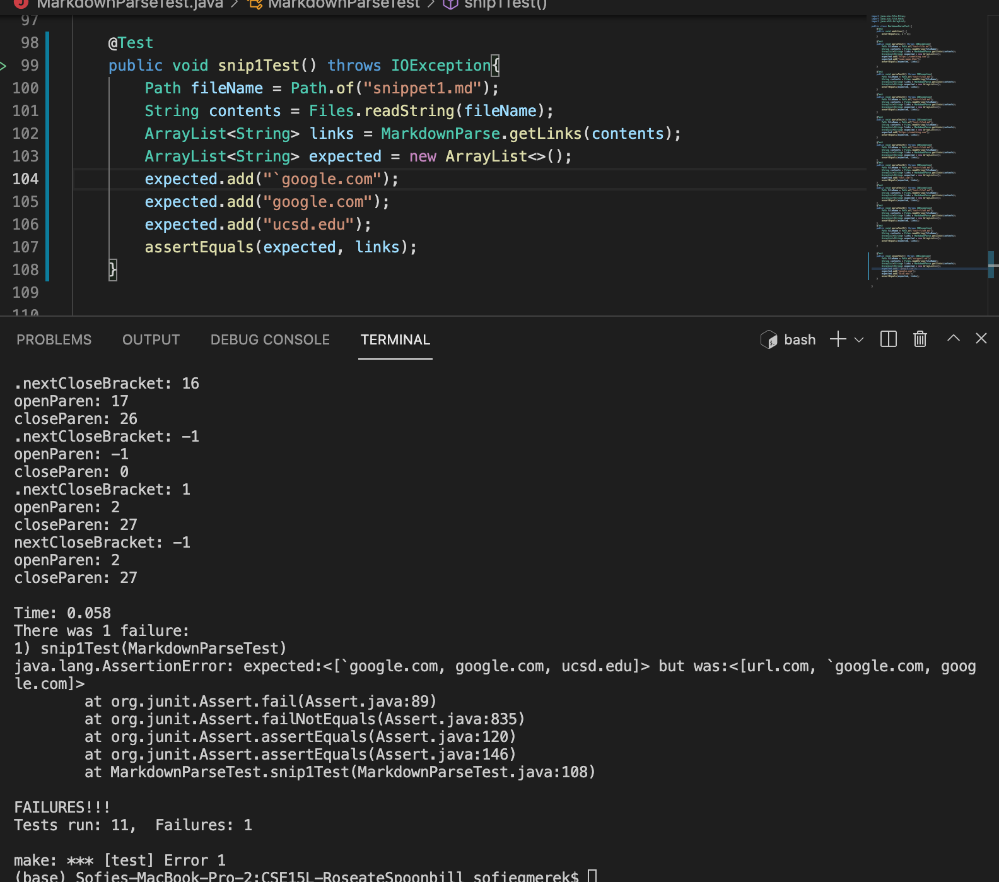
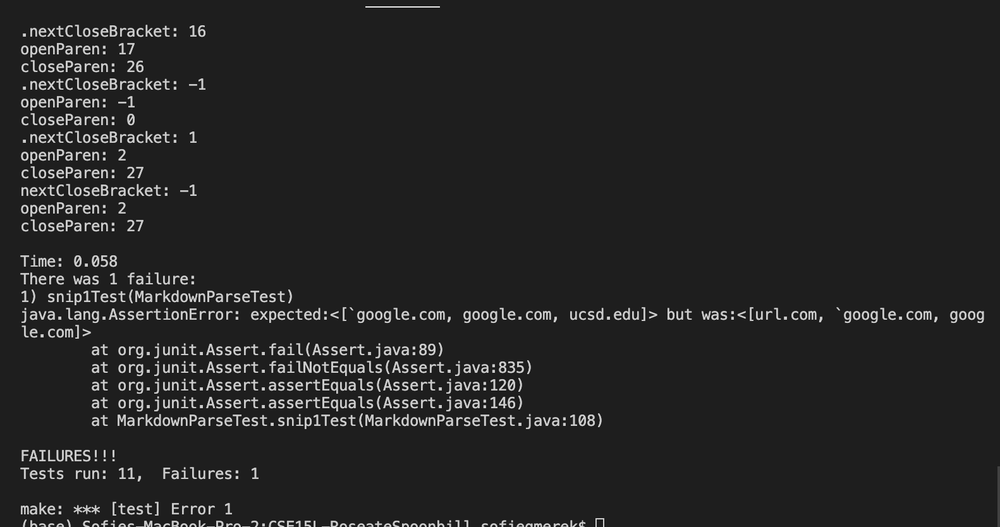
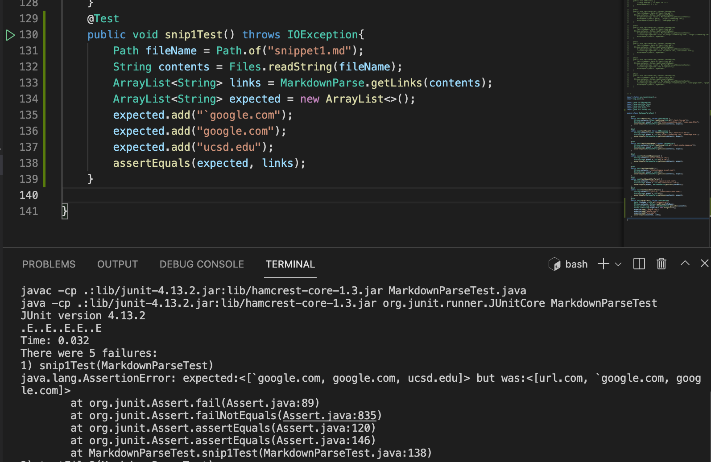
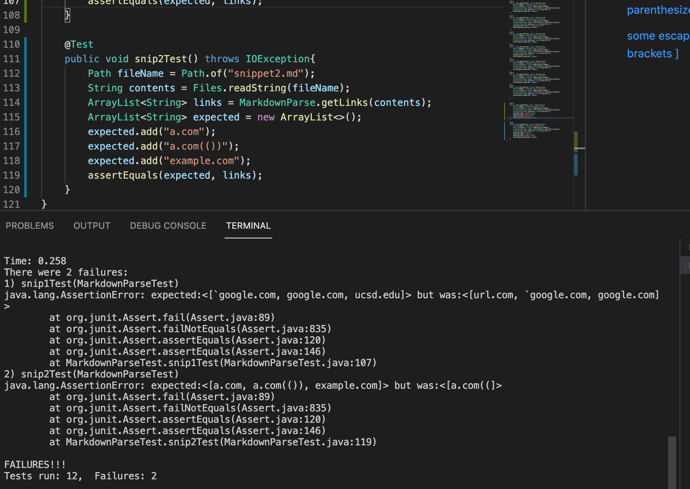
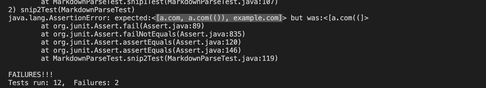
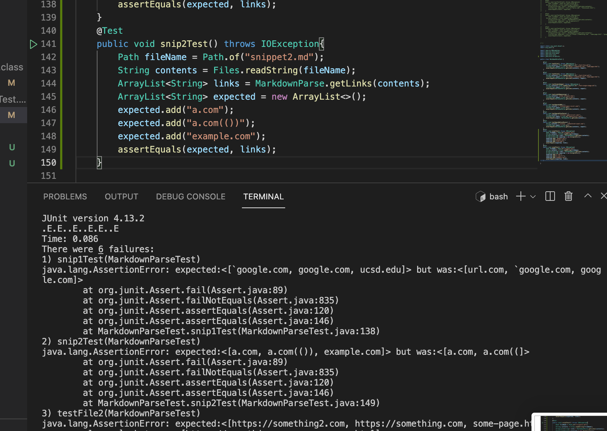
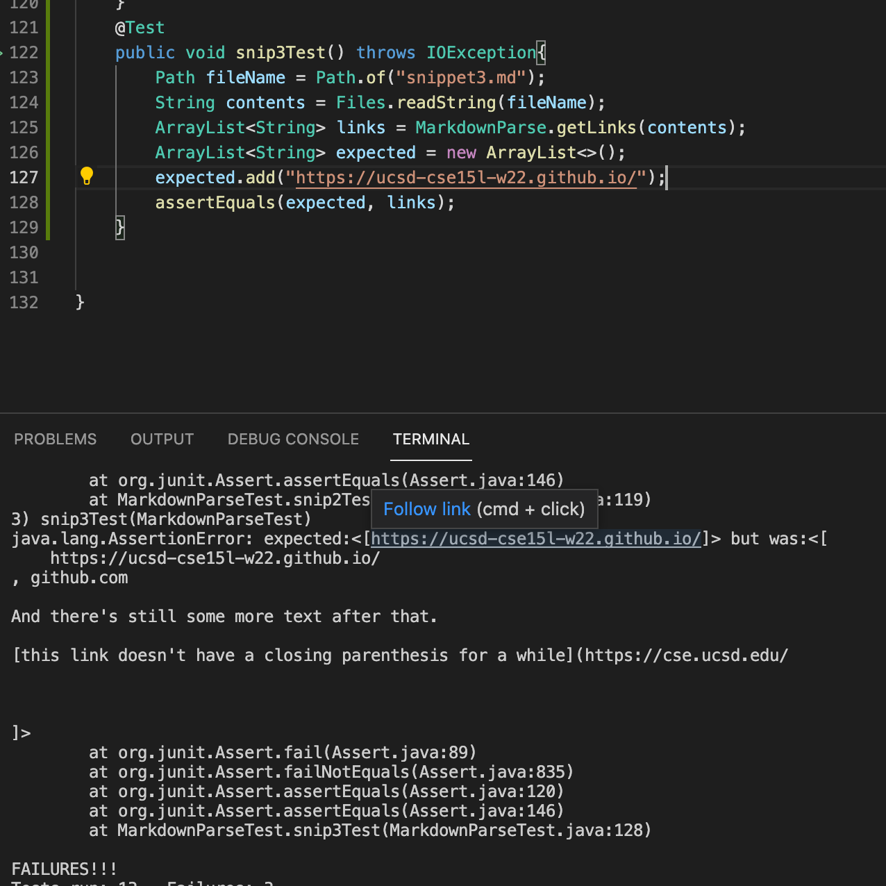
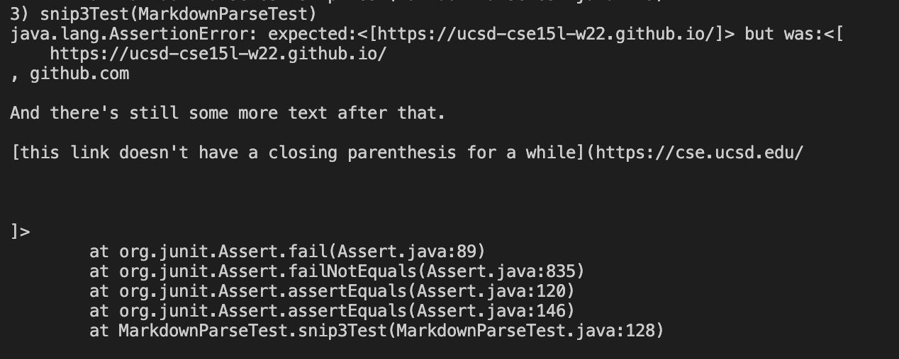
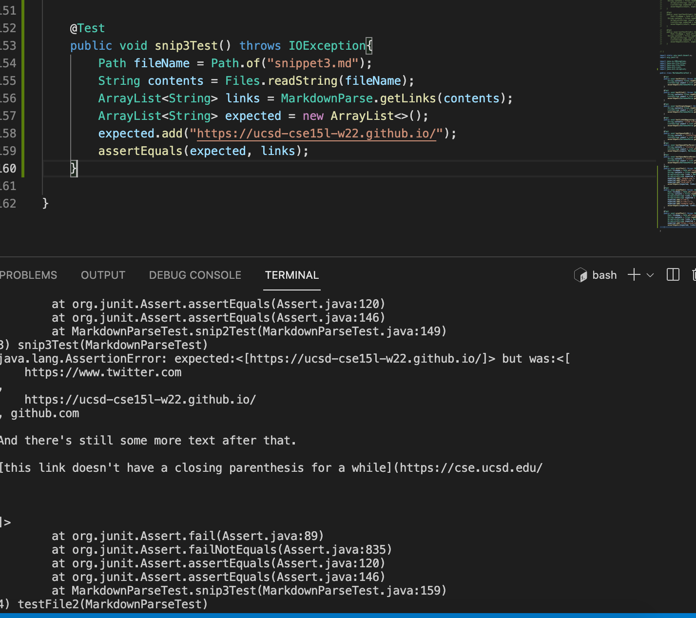

# Lab report 4

1. [Snippet 1](#Lab4_1)
2. [Snippet 2](#Lab4_2) 
3. [Snippet 3](#Lab4_3)

Links to repositories:
<br>
[Mine](https://github.com/sofiegmerek/CSE15L-RoseateSpoonbill)
<br>
[Other group's](https://github.com/Shree-G/markdown-parse)


## Snippet 1 <a name = "Lab4_1"></a>
```
`[a link`](url.com)

[another link](`google.com)`

[`cod[e`](google.com)

[`code]`](ucsd.edu)

```
These sample links should output as shown:
`[a link`](url.com)

[another link](`google.com)`

[`cod[e`](google.com)

[`code]`](ucsd.edu)

So our MarkdownParse should return 
```
["`google.com", "google.com", "ucsd.edu"] 
```
based on commonmark and our preview.
This is the test I created in order to test if this is functioning correctly and the corresponding failing output.

The code of the test is:
```
    @Test 
    public void snip1Test() throws IOException{
        Path fileName = Path.of("snippet1.md");
	    String contents = Files.readString(fileName);
        ArrayList<String> links = MarkdownParse.getLinks(contents);
        ArrayList<String> expected = new ArrayList<>();
        expected.add("`google.com");
        expected.add("google.com");
        expected.add("ucsd.edu");
        assertEquals(expected, links);  
    }

```
Here is the failing output:


Here is the code we reviewed, from the other lab group. 
Here is the test I made in their program and the output.


Neither of the programs passed the test.

I think that there is probably a small fix in order to make the code handle inline backticks. I think recognizing that by having one backtick on the outside of a line, makes it an invalid link if it does not end.  I think it could be fixed with an if statement or such to check if there's a backtick and to skip ahead to the other. Such as if theres a backtick before the opening brace, then skip to/move currentIndex to the next backtick.


## Snippet 2 <a name = "Lab4_2"></a>
```
[a [nested link](a.com)](b.com)

[a nested parenthesized url](a.com(()))

[some escaped \[ brackets \]](example.com)
```
This code snipped should output the following:
[a [nested link](a.com)](b.com)

[a nested parenthesized url](a.com(()))

[some escaped \[ brackets \]](example.com)

or "[a.com, a.com(()), example.com]"

Here is the output and the test from my markdown parse.

```    @Test 
    public void snip2Test() throws IOException{
        Path fileName = Path.of("snippet2.md");
	    String contents = Files.readString(fileName);
        ArrayList<String> links = MarkdownParse.getLinks(contents);
        ArrayList<String> expected = new ArrayList<>();
        expected.add("a.com");
        expected.add("a.com(())");
        expected.add("example.com");
        assertEquals(expected, links);  
    }
```

The test fails, here is the failing output.


Here is the test and output for the other group's markdown parse.



Both of the programs failed for this snippet. 
This could be fixed in a simple way to make the code work for nested parentheses. This could be done by having a check or making a function to see if there are nested parentheses in the link area, it could be less than 10 lines. I think similar to having another loop and checking for nested parentheses.


## Snippet 3 <a name = "Lab4_3"></a>
Here is the snippet 3:
```
[this title text is really long and takes up more than 
one line

and has some line breaks](
    https://www.twitter.com
)

[this title text is really long and takes up more than 
one line](
    https://ucsd-cse15l-w22.github.io/
)


[this link doesn't have a closing parenthesis](github.com

And there's still some more text after that.

[this link doesn't have a closing parenthesis for a while](https://cse.ucsd.edu/


)

And then there's more text
```
Based on the markdown output it shoudld return:
`[https://ucsd-cse15l-w22.github.io/]`

Here is the test and the output for my markdown parse. 


Here is the test in code:
```
    @Test 
    public void snip3Test() throws IOException{
        Path fileName = Path.of("snippet3.md");
	    String contents = Files.readString(fileName);
        ArrayList<String> links = MarkdownParse.getLinks(contents);
        ArrayList<String> expected = new ArrayList<>();
        expected.add("https://ucsd-cse15l-w22.github.io/");
        assertEquals(expected, links);  
    }
```
Here is the output:


Here is the other groups output:


I thinnk that this issue in snippet 3 of having newlines in brackets and parentheses could probably be fixed with a simple code fix. I think that it could be fixed with an if statement looking for empty newlines and determining that is is not valid. This could be a check for a newline that has nothing after it making the link invalid, so it could be a small code change.


