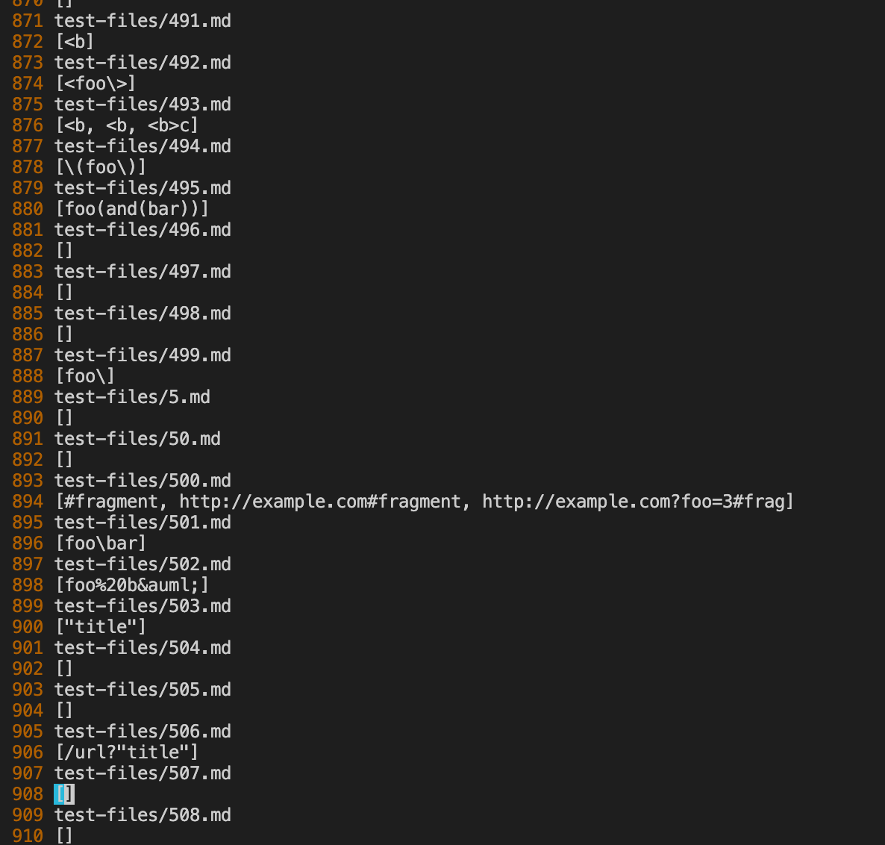

# Lab Report 5

To find the two failing tests I used diff to see the difference between the outputs of the programs, taking in all the test files.
 ```
 diff CSE15L-RoseateSpoonbill/output.txt lab9/markdown-parse/results.txt
 ````

For the given MDParse we used 
```
time bash script.sh > results.txt 
```
and for Our implementnation 
```
time bash script.sh > output.txt
```
to get the outputs, then since the diff gives line numbers I went into results.txt to find the line where there was a difference. 
 I used " :set number " in vim to see the line number and went down to the lines.

The results from our MD parse is  
The results from the given MD Parse is 
I now see the different outputs for the test files were for files 500 and 504.

Test 1: 500.md
Line 894 in the diff 
 

The actual file is 
The expected output is  
This is three links.

The given MD parse implementation is correct with this file, giving all three links correctly.
For our implementation which does not perform as expected, only giving 2 links, not the first one. So the given implementation gives the correct output.

The bug causing this is that the check for if theres an image is 
```
 if(markdown.indexOf("!") != nextOpenBracket - 1 &&
            openParen - nextCloseBracket == 1){
                System.out.println("inside");
               toReturn.add(markdown.substring(openParen + 1, closeParen));
           }
```
But if there are no "!" marks then the idnex is -1, and if the open bracket is 0, or there is a link at the start of the file, it will skip it. This can be fixed by having a check if the open parentheses index is 0 and not checking for the image "!" for that link. 


The second disparity which comes from line 900 in the diff 
is from file 504.md.
This file contains 
```
[link](/url "title")
[link](/url 'title')
[link](/url (title))
````
which according to commonmark should output 3 links as seen here. With title's title.


The given MarkdownParse outputs nothing, whcih is incorrect. Our implementation outputs the three links which is more correct, however it also includes the parentheses in the link which it should not and it should not innclude the title, as the linnk goes to url. Neither of the programs are correct.

For our implementation, the bug is that it is including everything in the parentheses, but not all of it is the link in this case. For this bug to fix it we can have a check if there is a space in the link, and if there are either enclosing quotations or parentheses with text inside indicating a title. This could then skip that part and only include the link.